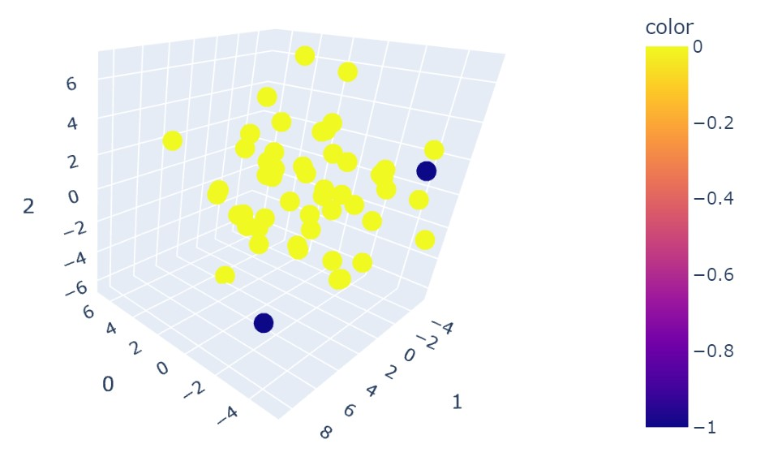

# adulterated-product-detection

## Background

Adulteration involves adding impurities or contaminants to a product to lower its quality or deceive consumers. Adulterated products are expected to have lower concentrations of certain compounds compared to their non-adulterated counterparts. Identifying such adulterated products can be challenging, especially when the concentrations of several analytes deviate from the average values but still fall within the normal range observed in non-adulterated counterparts. Traditional threshold-based methods struggle to detect these subtle variations within the normal range, as they primarily rely on identifying outliers or extreme deviations.

To overcome these challenges, I have developed an analytical tool that simulates adulteration scenarios and utilizes the DBSCAN machine learning clustering method (from Python scikit-learn). The tool allows for the construction of a model by using simulated datasets, enabling evaluation, fine-tuning, and improved detection of adulterated products exhibiting deviations within the normal range in real-world scenarios.

## Highlights

1. Detection accuracy exceeded 0.9 when 20% of the analytes had their concentrations reduced to values within the range of the 0th and 5th percentiles.

 
2. When the percentage of affected analytes is below 22%, analytes with lower variability in concentrations enhance the model's detection capability. As expected, increasing the number of altered analytes enables the model to detect adulterants regardless of the variability in analyte concentrations.

 
3. Data visualization using PCA. To visualize the detection results, one can apply PCA on the dataset that includes potential adulterated samples. By color coding each data point according to the predicted labels from DBSCAN, we can gain insights into the detection outcomes. In the figure below, it shows that 2 out 3 adulterated products were successfully detected in blue. 

Please see **[analysis.ipynb](https://github.com/alexkychen/adulterated-product-detection/blob/main/analysis.ipynb)** for more details of the analysis and use cases.

## Referenced data simulation

This tool includes a function `generate_ref_data` to generate a referenced dataset representing authentic or non-adulterated product data. This dataset serves as a reference for detecting adulterated samples. Parameters such as sample size, number of analytes, and analyte quantitative boundaries can be customized to simulate real-world data. After generating the referenced data, users can utilize it to create random samples, both adulterated and non-adulterated, for evaluating the performance of their model.

> *function* **generate_ref_data**(*num_sample=50, num_analyte=200, mean_low=20, mean_high=1000, std_factor_low=0.1, std_factor_high=0.5, seed=None*)

- Params:
    - **num_sample** [int]: Number of samples to be generated.
    - **num_analyte** [int]: Number of analytes to be generated.
    - **mean_low** [int]: Lower bound of mean analyte concentration.
    - **mean_high** [int]: Upper bound of mean analyte concentration.
    - **std_factor_low** [float]: Floating value (0-1) to determine lower bound of standard deviation.  
    - **std_factor_high** [float]: Floating value (0-1) to determine upper bound of standard deviation. 
    - seed [int or None]: random seed
- Returns:
    - Numpy 2d array

## Adulterated and non-adulterated products simulation

This tool also provides the `generate_random_sample` function, which generates a random sample to be combined with the referenced data for DBSCAN analysis. This function examines the referenced data input and creates either a non-adulterated or adulterated sample based on user specifications. This enables the evaluation of model performance metrics. For generating an adulterated sample, users can set parameters to determine the number of analytes and how their concentrations should be altered to mimic the chemical composition of an adulterated product. This allows for the identification of patterns in model detectability under different adulteration scenarios.

> *function* **generate_random_sample**(*data, adulterated=False, num_analyte=30, analyte_select_method="random", conc_percentile=(0, 5),seed=None*)

- Params:
    - **data** [numpy array]: Your input referenced dataset. 
    - **adulterated** [bool]: Determine whether to generate an adulterated(True) or non-adulterated(False) sample.
    - **num_analyte** [int]: Number of analytes for adulteratoins.
    - **analyte_select_method** [str]:
        - "random": Select analytes randomly 
        - "high": Select analytes with greater variations (std dev) for adulterations.
        - "low": Select analytes with less varaitions (std dev) for adulterations.
    - **conc_percentile**: A set of two percentile values between 0 and 100 inclusive to determine the range of analyte concentrations to be altered. e.g., (0, 5) will make the analyte concentration falls within the interval of 0th and 5th percentiles from the referenced data.
    - **seed** [int or None]: random seed
- Returns:
    - when adulterated = False, return a numpy array with shape of (1, n) where n = number of analytes in input data.
    - when adulterated = True, return a numpy array as described above, and a list of indices of selected variables/analytes. 

